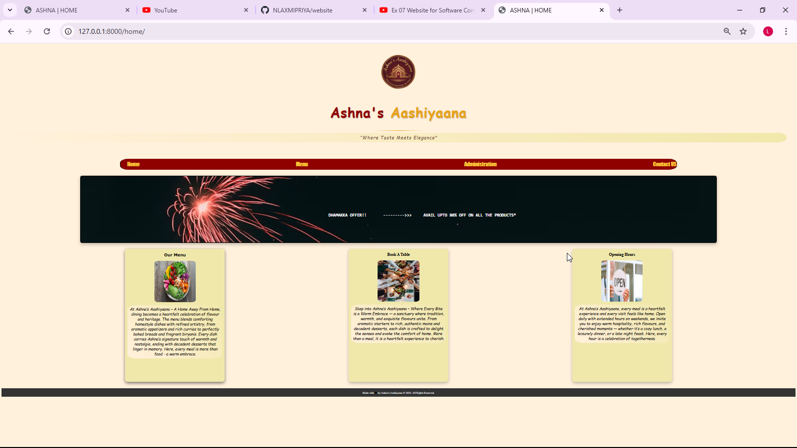
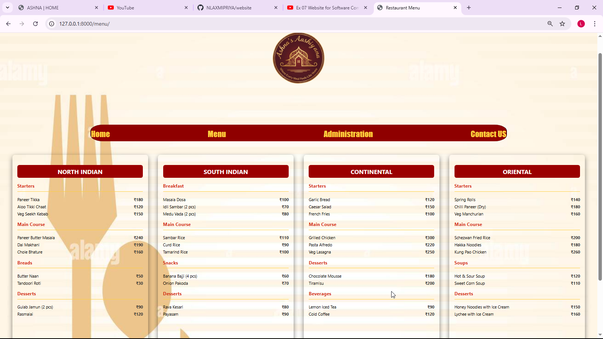
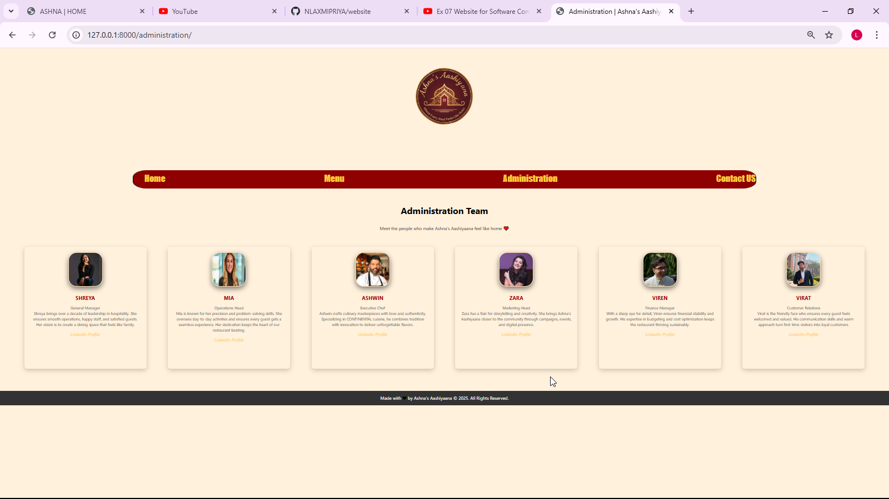
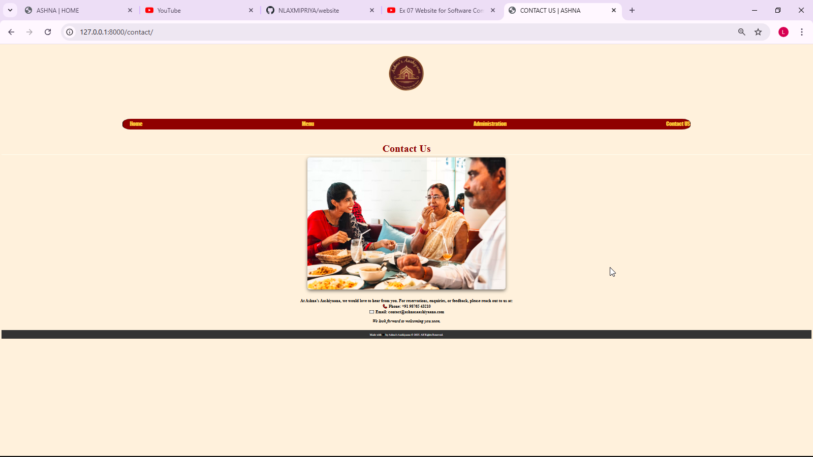

# Ex.07 Restaurant Website
# Date:04-10-2025
# AIM:
To develop a static Restaurant website to display the food items and services provided by them.

# DESIGN STEPS:
## Step 1:
Requirement collection.

## Step 2:
Creating the layout using HTML and CSS.

## Step 3:
Updating the sample content.

## Step 4:
Choose the appropriate style and color scheme.

## Step 5:
Validate the layout in various browsers.

## Step 6:
Validate the HTML code.

## Step 7:
Publish the website in the given URL.

# PROGRAM:
```
home.html 

<!DOCTYPE html>
<html lang="en">
<head>
    <meta charset="UTF-8">
    <meta name="viewport" content="width=device-width, initial-scale=1.0">
    <title>ASHNA | HOME</title>
    <link rel="stylesheet" href=" ">
</head>
<body>
    <header>
<div style="text-align: center; margin: 40px;">
    <!-- Logo -->
    

    <!-- Restaurant Name -->
    <h1 style="font-size: 80px; font-family: 'Cinzel Decorative', cursive; 
color: maroon; margin-top: 20px; text-align: center; 
letter-spacing: 3px; text-shadow: 2px 2px 6px rgba(0,0,0,0.3);">
        Ashna's <span style="color: goldenrod;">Aashiyaana</span>
    </h1>

    <!-- Stylish HR -->
    <hr style="width: 300px; height: 4px; border: none; 
    background: linear-gradient(to right, transparent, goldenrod, transparent); 
    margin: 10px auto; border-radius: 50px;">

    <!-- Tagline -->
    <p style="font-size: 28px; font-family: 'Great Vibes', cursive; 
    color: #5a3e2b; margin-top: 10px; letter-spacing: 2px; 
    font-style: italic;">
        “Where Taste Meets Elegance”
    </p>
</div>

        

    <nav class="container"><ul><li>
    <a href="">Home</a>
    </li>
    <li><a href="">Menu</a></li>
    <li><a href="">Administration</a></li>
    <li><a href="">Contact US</a></li>
</ul></nav></header>
<br>
<br>
<main>
    <div class="offer">
        <pre><h1 class="head">      DHAMAKKA OFFER!!       --------->>>     AVAIL UPTO 80% OFF ON ALL THE PRODUCTS*</h1></pre>
    </div>
    <br>
    <br>
    <div class="container_">
        <div id="item1">
            <center>
            <h2 style="font-family: Verdana, Geneva, Tahoma, sans-serif;">Our Menu</h2>
            <br>
            <p style="font-style: oblique;">At Ashna’s Aashiyaana – A Home Away From Home, dining becomes a heartfelt celebration of flavour and heritage. The menu blends comforting homestyle dishes with refined artistry, from aromatic appetizers and rich curries to perfectly baked breads and fragrant biryanis. Every dish carries Ashna’s signature touch of warmth and nostalgia, ending with decadent desserts that linger in memory. Here, every meal is more than food - a warm embrace.
            </p></center>
        </div>
        <div id="item2">
            <center>
            <h2>Book A Table</h2>
            <br>
            <p style="font-style: oblique;">Step into Ashna’s Aashiyaana – Where Every Bite is a Warm Embrace — a sanctuary where tradition, warmth, and exquisite flavours unite. From aromatic starters to rich, authentic mains and decadent desserts, each dish is crafted to delight the senses and evoke the comfort of home. More than a meal, it is a heartfelt experience to cherish.
            </p></center>
        </div>
        <div id="item3">
            <center>
            <h2>Opening Hours</h2>
            <br>
<p style="font-style: oblique;">At Ashna’s Aashiyaana, every meal is a heartfelt experience and every visit feels like home. Open daily with extended hours on weekends, we invite you to enjoy warm hospitality, rich flavours, and cherished moments — whether it’s a cozy lunch, a leisurely dinner, or a late-night feast. Here, every hour is a celebration of togetherness.
</p></center>
        </div>
    </div>
</main>
    <footer>
    <div class="footer-bottom">
    Made with <span style="color: black">&#10084;</span> by Ashna’s Aashiyaana &copy; 2025. All Rights Reserved.
</div>
    </footer>
</body>
</html>

home.css
body{
    background-color: #fdf1dc;   /* light beige */
}
nav{
    height: 65px;
    width: 70%;
    border: 2px solid black;
    margin: auto;
    margin-top: 100px;
    border-radius: 50px / 25px; 
    border-top: #BFABCB;
    border-bottom: #BFABCB;
    background-color: maroon;
    text-align: center;
}
ul{
    display: flex;
    justify-content: space-between;
    color: #f4d03f;
    font-size: xx-large;
    text-align: center;
    align-items: center;
}
li{
    display: inline-block;
    font-family: Impact, Haettenschweiler, 'Arial Narrow Bold', sans-serif;
    color: #f4d03f;
    font-size: xx-large;
    padding-top: 10px;

    
}
a{
    text-decoration: none;
    color: #f4d03f;
}
.container_{
    margin: auto;
    display: flex;
    flex-direction: row;
    width: auto;
    height: auto;
    background-color: inherit;
    justify-content: space-evenly;

}
#item1{
    height: 800px;
    width: 600px;
    display: inline-block;
    border: #C68642;
    border-radius: 15px;
    background-color:#EEE8AA;
    box-shadow: 0px 8px 20px rgba(0,0,0,0.5);
    
}
#item2{
height: 800px;
width: 600px;
    display: inline-block;
    border: none;
    border-radius: 15px;
    background-color: #EEE8AA;
    box-shadow: 0px 8px 20px rgba(0,0,0,0.25);
}
#item3{
height: 800px;
width: 600px;
    display: inline-block;
    border: #C68642;
    border-radius: 15px;
    background-color: #EEE8AA;
    box-shadow: 0px 8px 20px rgba(0,0,0,0.25);
}
p {
    font-family: cursive;
    font-weight: 200;
    font-size: 23px;
    background: linear-gradient(45deg,#fdf1dc,#EEE8AA);
    border-radius: 50px / 25px;
    padding: 10px;
    margin: 15px;
}
.offer{
    height:400px;
    width: 80%;
    background-image: url('https://images.unsplash.com/photo-1699854227507-4b9ff940652a?q=80&w=1170&auto=format&fit=crop&ixlib=rb-4.1.0&ixid=M3wxMjA3fDB8MHxwaG90by1wYWdlfHx8fGVufDB8fHx8fA%3D%3D');
    background-size: cover;
    background-repeat: no-repeat;
    margin:auto;
    text-align:center;
    border:5px solid black;
    border-radius:10px;
    box-shadow: 0px 8px 20px rgba(0,0,0,0.25);

}
.head{
    position:relative;
    top:200px;
    right:1200px;
    bottom:800px;
    left:100px;
    color:white;
}
                .footer-bottom{
            text-align: center;
            padding: 15px;
            background: #333;
            color: white;
            margin-top: 40px;
        }
img{
    border-radius: 25px/12.5px;
}


Menu.html

<!DOCTYPE html>
<html lang="en">
<head>
    <meta charset="UTF-8">
    <meta name="viewport" content="width=device-width, initial-scale=1.0">
    <title>Restaurant Menu</title>
    <style>
        nav{
    height: 65px;
    width: 70%;
    border: 2px solid black;
    margin: auto;
    margin-top: 100px;
    border-radius: 50px / 25px; 
    border-top: #BFABCB;
    border-bottom: #BFABCB;
    background-color: maroon;
    text-align: center;
}
.top_list{
    display: flex;
    justify-content: space-between;
    color: #392F5A;
    font-size: xx-large;
    text-align: center;
    align-items: center;
}
.list{
    display: inline-block;
    font-family: Impact, Haettenschweiler, 'Arial Narrow Bold', sans-serif;
    color: #f4d03f;
    font-size: xx-large;
    padding-top: 10px;

    
}
a{
    text-decoration: none;
    color: #f4d03f;
}
        body {
            background-image: url("https://c8.alamy.com/comp/EMEY0B/template-for-menu-card-with-cutlery-vector-illustration-EMEY0B.jpg");
            background-repeat: no-repeat; 
            background-size: cover;  
            background-color: #C2C5BB;
            font-family: 'Segoe UI', Tahoma, Geneva, Verdana, sans-serif;
        }
.container_{
    display: flex;
    flex-wrap: wrap;
    margin:auto;
    gap: 20px;
    justify-content: center;
}

.item1,.item2,.item3,.item4 {
    width: 500px;
    height: 70vh;  
    padding: 20px;
    margin: 10px;
    background: transparent;
    /* background-color: #F3DAD8; */
    border-radius: 10px;
    box-shadow: 0px 8px 20px rgba(0,0,0,0.5);
}

        h2 {
            text-align: center;
            background: #8B0000;
            color: white;
            padding: 10px;
            border-radius: 8px;
        }
        h3 {
            color: #c0392b;
            border-bottom: 2px solid #f4d03f;
            padding-bottom: 10px; 
        }
        ul {
            list-style-type: none;
            padding: 0; 
        }
        li {
            display: flex;
            justify-content: space-between;
            margin: 6px 0;
            font-size: 16px;
        }
        .price {
            color: #333;
            font-weight: bold;
        }
                .footer-bottom{
            text-align: center;
            padding: 15px;
            background: #333;
            color: white;
            margin-top: 40px;
        }
    </style>
</head>
<body>
    <header>
    <div style="text-align: center; margin: 40px;">
    

</div>
    <nav class="container"><ul class="top_list"><li class="list">
    <a href="">Home</a>
    </li>
    <li class="list"><a href="">Menu</a></li>
    <li class="list"><a href="">Administration</a></li>
    <li class="list"><a href="">Contact US</a></li>
</ul></nav></header>
<br>
<br>
    <div class="container_">
        
        <!-- NORTH INDIAN -->
        <div class="item1">
            <h2>NORTH INDIAN</h2>
            <h3>Starters</h3>
            <ul>
                <li><span>Paneer Tikka</span><span class="price">₹180</span></li>
                <li><span>Aloo Tikki Chaat</span><span class="price">₹120</span></li>
                <li><span>Veg Seekh Kebab</span><span class="price">₹150</span></li>
            </ul>
            <h3>Main Course</h3>
            <ul>
                <li><span>Paneer Butter Masala</span><span class="price">₹240</span></li>
                <li><span>Dal Makhani</span><span class="price">₹190</span></li>
                <li><span>Chole Bhature</span><span class="price">₹160</span></li>
            </ul>
            <h3>Breads</h3>
            <ul>
                <li><span>Butter Naan</span><span class="price">₹50</span></li>
                <li><span>Tandoori Roti</span><span class="price">₹30</span></li>
            </ul>
            <h3>Desserts</h3>
            <ul>
                <li><span>Gulab Jamun (2 pcs)</span><span class="price">₹90</span></li>
                <li><span>Rasmalai</span><span class="price">₹120</span></li>
            </ul>
        </div>

        <!-- SOUTH INDIAN -->
        <div class="item2">
            <h2>SOUTH INDIAN</h2>
            <h3>Breakfast</h3>
            <ul>
                <li><span>Masala Dosa</span><span class="price">₹100</span></li>
                <li><span>Idli Sambar (2 pcs)</span><span class="price">₹70</span></li>
                <li><span>Medu Vada (2 pcs)</span><span class="price">₹80</span></li>
            </ul>
            <h3>Main Course</h3>
            <ul>
                <li><span>Sambar Rice</span><span class="price">₹110</span></li>
                <li><span>Curd Rice</span><span class="price">₹90</span></li>
                <li><span>Tamarind Rice</span><span class="price">₹100</span></li>
            </ul>
            <h3>Snacks</h3>
            <ul>
                <li><span>Banana Bajji (4 pcs)</span><span class="price">₹60</span></li>
                <li><span>Onion Pakoda</span><span class="price">₹70</span></li>
            </ul>
            <h3>Desserts</h3>
            <ul>
                <li><span>Rava Kesari</span><span class="price">₹80</span></li>
                <li><span>Payasam</span><span class="price">₹90</span></li>
            </ul>
        </div>

        <!-- CONTINENTAL -->
        <div class="item3">
            <h2>CONTINENTAL</h2>
            <h3>Starters</h3>
            <ul>
                <li><span>Garlic Bread</span><span class="price">₹120</span></li>
                <li><span>Caesar Salad</span><span class="price">₹150</span></li>
                <li><span>French Fries</span><span class="price">₹100</span></li>
            </ul>
            <h3>Main Course</h3>
            <ul>
                <li><span>Grilled Chicken</span><span class="price">₹300</span></li>
                <li><span>Pasta Alfredo</span><span class="price">₹220</span></li>
                <li><span>Veg Lasagna</span><span class="price">₹250</span></li>
            </ul>
            <h3>Desserts</h3>
            <ul>
                <li><span>Chocolate Mousse</span><span class="price">₹180</span></li>
                <li><span>Tiramisu</span><span class="price">₹200</span></li>
            </ul>
            <h3>Beverages</h3>
            <ul>
                <li><span>Lemon Iced Tea</span><span class="price">₹90</span></li>
                <li><span>Cold Coffee</span><span class="price">₹120</span></li>
            </ul>
        </div>

        <!-- ORIENTAL -->
        <div class="item4">
            <h2>ORIENTAL</h2>
            <h3>Starters</h3>
            <ul>
                <li><span>Spring Rolls</span><span class="price">₹140</span></li>
                <li><span>Chilli Paneer (Dry)</span><span class="price">₹180</span></li>
                <li><span>Veg Manchurian</span><span class="price">₹160</span></li>
            </ul>
            <h3>Main Course</h3>
            <ul>
                <li><span>Schezwan Fried Rice</span><span class="price">₹200</span></li>
                <li><span>Hakka Noodles</span><span class="price">₹180</span></li>
                <li><span>Kung Pao Chicken</span><span class="price">₹260</span></li>
            </ul>
            <h3>Soups</h3>
            <ul>
                <li><span>Hot & Sour Soup</span><span class="price">₹120</span></li>
                <li><span>Sweet Corn Soup</span><span class="price">₹110</span></li>
            </ul>
            <h3>Desserts</h3>
            <ul>
                <li><span>Honey Noodles with Ice Cream</span><span class="price">₹150</span></li>
                <li><span>Lychee with Ice Cream</span><span class="price">₹160</span></li>
            </ul>
        </div>

    </div>
    <footer>
    <div class="footer-bottom">
    Made with <span style="color: black">&#10084;</span> by Ashna’s Aashiyaana &copy; 2025. All Rights Reserved.
</div>
    </footer>
</body>
</html>


administration.html

<!DOCTYPE html>
<html lang="en">
<head>
    <meta charset="UTF-8">
    <meta name="viewport" content="width=device-width, initial-scale=1.0">
    <title>Administration | Ashna’s Aashiyaana</title>
    <style>
        body {
            font-family: 'Segoe UI', Tahoma, Geneva, Verdana, sans-serif;
            margin: 0;
            padding: 0;
            background-color: #fdf1dc;
            color: #333;
        }
        .head {
            background-color: inherit;
            color: black;
            padding: 15px;
            text-align: center;
        }
        h1 {
            margin: 0;
        }
        .team-container {
            display: flex;
            flex-wrap: wrap;
            justify-content: center;
            justify-content: space-evenly;
            gap: 30px;
            padding: 40px;
        }
        .team-member {
            width: 400px;
            height: 400px;
            background: transparent;
            border-radius: 10px;
            box-shadow: 0 6px 18px rgba(0,0,0,0.2);
            text-align: center;
            padding: 20px;
        }
        .team-member img {
            width: 120px;
            height: 120px;
            border-radius: 30px;
            margin-bottom: 15px;
            border: 3px solid wheat;
            box-shadow: 0px 8px 20px rgba(0,0,0,0.5);
        }
        .team-member h3 {
            margin: 10px 0 5px;
            color: #8B0000;
        }
        .team-member p {
            font-size: 14px;
            color: #555;
        }
        .footer-bottom{
            text-align: center;
            padding: 15px;
            background: #333;
            color: white;
            margin-top: 40px;
        }
        nav{
    height: 65px;
    width: 70%;
    border: 2px solid black;
    margin: auto;
    margin-top: 100px;
    border-radius: 50px / 25px; 
    border-top: #BFABCB;
    border-bottom: #BFABCB;
    background-color: maroon;
    text-align: center;
}
ul{
    display: flex;
    justify-content: space-between;
    color: black;
    font-size: xx-large;
    text-align: center;
    align-items: center;
}
li{
    display: inline-block;
    font-family: Impact, Haettenschweiler, 'Arial Narrow Bold', sans-serif;
    color: #392F5A;
    font-size: xx-large;
    padding-top: 10px;

    
}
a{
    text-decoration: none;
    color: #f4d03f;
}
p{
    text-align: center;
}
.in{
    color: #f4d03f;
}
    </style>
</head>
<body>
    <header>
    <div style="text-align: center; margin: 40px;">
    

</div>
    <nav class="container"><ul class="top_list"><li class="list">
    <a href="">Home</a>
    </li>
    <li class="list"><a href="">Menu</a></li>
    <li class="list"><a href="">Administration</a></li>
    <li class="list"><a href="">Contact US</a></li>
</ul></nav>
<br>
<br>
        <h1 class="head">Administration Team</h1>
        <p>Meet the people who make Ashna’s Aashiyaana feel like home ❤️</p>
    </header>

    <div class="team-container">
        <div class="team-member">
            
            <h3>SHREYA</h3>
            <p>General Manager<br>
            Shreya brings over a decade of leadership in hospitality. She ensures smooth operations, happy staff, and satisfied guests. Her vision is to create a dining space that feels like family.  
            </p>
            <cite><a href="https://www.linkedin.com/in/shreya" target="_blank" class="in">LinkedIn Profile</a></cite>
        </div>

        <div class="team-member">
            
            <h3>MIA</h3>
            <p>Operations Head<br>
            Mia is known for her precision and problem-solving skills. She oversees day-to-day activities and ensures every guest gets a seamless experience. Her dedication keeps the heart of our restaurant beating.  
            </p>
            <cite><a href="https://www.linkedin.com/in/mia" target="_blank">LinkedIn Profile</a></cite>
        </div>

        <div class="team-member">
            
            <h3>ASHWIN</h3>
            <p>Executive Chef<br>
            Ashwin crafts culinary masterpieces with love and authenticity. Specializing in CONTINENTAL cuisine, he combines tradition with innovation to deliver unforgettable flavors.  
            </p>
            <cite><a href="https://www.linkedin.com/in/ashwin" target="_blank">LinkedIn Profile</a></cite>
        </div>

        <div class="team-member">
            
            <h3>ZARA</h3>
            <p>Marketing Head<br>
            Zara has a flair for storytelling and creativity. She brings Ashna’s Aashiyaana closer to the community through campaigns, events, and digital presence.  
            </p>
            <cite><a href="https://www.linkedin.com/in/zara" target="_blank">LinkedIn Profile</a></cite>
        </div>

        <div class="team-member">
            
            <h3>VIREN</h3>
            <p>Finance Manager<br>
            With a sharp eye for detail, Viren ensures financial stability and growth. His expertise in budgeting and cost optimization keeps the restaurant thriving sustainably.  
            </p>
            <cite><a href="https://www.linkedin.com/in/viren" target="_blank">LinkedIn Profile</a></cite>
        </div>

        <div class="team-member">
            
            <h3>VIRAT</h3>
            <p>Customer Relations<br>
            Virat is the friendly face who ensures every guest feels welcomed and valued. His communication skills and warm approach turn first-time visitors into loyal customers.  
            </p>
            <cite><a href="https://www.linkedin.com/in/virat" target="_blank">LinkedIn Profile</a></cite>
        </div>
    </div>

    <footer>
           <div class="footer-bottom">
    Made with <span style="color: black">&#10084;</span> by Ashna’s Aashiyaana &copy; 2025. All Rights Reserved.
</div>
    </footer>
</body>
</html>


contact.html

<!DOCTYPE html>
<html lang="en">
<head>
    <meta charset="UTF-8">
    <meta name="viewport" content="width=device-width, initial-scale=1.0">
    <title>CONTACT US | ASHNA</title>
    <style>
        body{
    background-color: #fdf1dc
        }
        h1{
            text-align: center;
            font-family: 'Franklin Gothic Medium', 'Arial Narrow', Arial, sans-serif;
            border-bottom: 3px solid ivory;
            margin-bottom: 15px;
            font-size: 60px;
        }
        .fam{
            display: block;
            margin: auto;
            border-radius: 15px;
            box-shadow: 0px 8px 20px rgba(0,0,0,0.5);
        }
                .footer-bottom{
            text-align: center;
            padding: 15px;
            background: #333;
            color: white;
            margin-top: 40px;
        }
        nav{
    height: 65px;
    width: 70%;
    border: 2px solid black;
    margin: auto;
    margin-top: 100px;
    border-radius: 50px / 25px; 
    border-top: #BFABCB;
    border-bottom: #BFABCB;
    background-color: maroon;
    text-align: center;
}
ul{
    display: flex;
    justify-content: space-between;
    color: #392F5A;
    font-size: xx-large;
    text-align: center;
    align-items: center;
}
li{
    display: inline-block;
    font-family: Impact, Haettenschweiler, 'Arial Narrow Bold', sans-serif;
    color: #f4d03f;
    font-size: xx-large;
    padding-top: 10px;

    
}
a{
    text-decoration: none;
    color: #f4d03f;
}
    </style>
</head>
<body>
    <header>
    <div style="text-align: center; margin: 40px;">
    

</div>
    <nav class="container"><ul class="top_list"><li class="list">
    <a href="">Home</a>
    </li>
    <li class="list"><a href="">Menu</a></li>
    <li class="list"><a href="">Administration</a></li>
    <li class="list"><a href="">Contact US</a></li>
</ul></nav>
<br>
<br>
    <h1 class="h" style="color: maroon; font-family: 'Times New Roman', Times, serif;">Contact Us</h1>
    
    <center>
    <br>
    <br>
    <br>
<div style="font-size: x-large;">
<strong>
At Ashna’s Aashiyaana, we would love to hear from you. For reservations, enquiries, or feedback, please reach out to us at: 
<br>
📞 Phone: +91 98765 43210
<br>
✉️ Email: contact@ashnasaashiyaana.com
<br>
<br>
<i>We look forward to welcoming you soon.</i>
    </center> </strong></div>
    <footer>
    <div class="footer-bottom">
    Made with <span style="color: black">&#10084;</span> by Ashna’s Aashiyaana &copy; 2025. All Rights Reserved.
</div>
    </footer>
</body>
</html>

```
# OUTPUT:




# RESULT:
The program for designing software company website using HTML and CSS is completed successfully.
